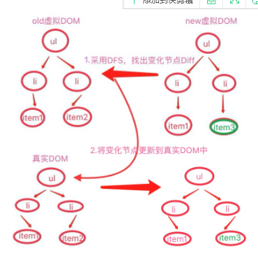

1:首先，需要利用Object.defineProperty，将要观察的对象，转化成getter/setter，以便拦截对象赋值与取值操作，称之为Observer；
2:需要将DOM解析，提取其中的指令与占位符，并赋与不同的操作，称之为Compiler；
3:需要将Compile的解析结果，与Observer所观察的对象连接起来，建立关系，在Observer观察到对象数据变化时，接收通知，同时更新DOM，称之为Watcher；
4:最后，需要一个公共入口对象，接收配置，协调上述三者，称为Vue;
```
是因为JS在浏览器中是单线程执行的！！所以在执行这个监听器的添加过程时，决不会有其他的监听器去修改全局变量target！！
```
### 文章来源
...
https://blog.csdn.net/pur_e/article/details/53066275 
...
### vue虚拟dom
虚拟Dom可以提升页面的刷新速度
以前的js改变页面：document.getElementById('myId').appendChild(myNewNode);
当节点成千上万是操作就会非常消耗性能
>  <ul id='myId'>
>	  <li>Item 1</li>
>	  <li>Item 2</li>
>  <ul>
Dom节点也可以表示成js中的对象
>  Let domNode = {
>    tag: 'ul'
>    attributes: { id: 'myId' }
>    children: [
>      
>    ]
>  };
更新虚拟节点开销不大：
>  domNode.children.push('<ul>Item 3</ul>');
接下来就是同步的把我们做的改变更新到‘真实’的Dom中去
>  sync(originalDomNode, domNode);
这个方法是调用DOM API来更改真正DOM的 它会分批执行从而获取更高的效率
对于.vue的文件我们都可以用render的方法直接创建新节点:
>  new Vue({
>    el: '#app',
>    data: {
>     message: 'hello world'
>    },
>    render() {
>      var node = this.$createElement;
>      return node(
>        'div', 
>        { attrs: { id: 'myId' } }, 
>        this.message
>      );
>    }
>  });
输出：
>  <div id='app'>
>    <div id='myId'>hello world</div>
>  </div> 
```
根据虚拟的dom节点的属性和子节点我们可以很方便的构建真实的dom树
```
>  VElement.prototype.render = function() {
>      //创建标签
>      var el = document.createElement(this.tagName);
>      //设置标签的属性
>      var props = this.props;
>      for (var propName in props) {
>          var propValue = props[propName]
>          util.setAttr(el, propName, propValue);
>      }
 
>      //依次创建子节点的标签
>      util.each(this.children, function(child) {
>  //如果子节点仍然为velement，则递归的创建子节点，否则直接创建文本类型节点
>          var childEl = (child instanceof VElement) ? child.render() : document.createTextNode(child);
>          el.appendChild(childEl);
>      });
>   
>      return el;
>  }
对于一个虚拟的Dom对象VElement,调用其原型的render方法,就可以产生一颗真正的dom树  vdom.render();
对树节点通过深度优先遍历和广度优先遍历逐个节点的创建真实的dom节点（createElement，createTextNode）
### 如何处理dom节点的更新
```
处理dom更新时,怎样通过新旧虚拟Dom对比,将变化部分更新到真实Dom中,增删改查
```
要将变化的节点更新到真实的Dom,需要传入真实Dom的根节点

实现函数
>  function updateElement($root, newElem, oldElem, index = 0) {
>      if (!oldElem){
>          $root.appendChild(newElem.render());
>      } else if (!newElem) {
>          $root.removeChild($root.childNodes[index]);
>      } else if (changed(newElem, oldElem)) {
>          if (typeof newElem === 'string') {
>              $root.childNodes[index].textContent = newElem;
>          } else {
>              $root.replaceChild(newElem.render(), $root.childNodes[index]);
>          }
>      } else if (newElem.tagName) {
>          let newLen = newElem.children.length;
>          let oldLen = oldElem.children.length;
>          for (let i = 0; i < newLen || i < oldLen; i++) {
>              updateElement($root.childNodes[index], newElem.children[i], oldElem.children[i], i)
>          }
>      }
>  }
>  function changed(elem1, elem2) {
>      return (typeof elem1 !== typeof elem2) ||
>             (typeof elem1 === 'string' && elem1 !== elem2) ||
>             (elem1.type !== elem2.type);
>  }